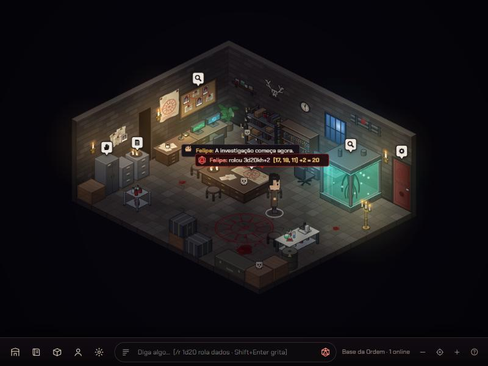

# CROMA



Tabuleiro digital isométrico multiplayer: quartos em grade, personagens que andam respeitando os mobis, chat em balões, dados de RPG e pistas que o mestre esconde e revela. A mecânica segue o modelo clássico dos hotéis isométricos (servidor autoritativo, heightmap, empilhamento de mobis). O visual é original, no clima de investigação paranormal.

## Rodando

Requisitos: Node 20+ (testado no 24).

```bash
npm install
npm run dev
```

Abra http://localhost:5173. O servidor de jogo sobe junto na porta 3001; o Vite faz proxy de `/ws`, `/api` e `/uploads`.

Para abrir vários jogadores, use outra aba (ou janela anônima) com outro nome.

### Produção

```bash
npm run build
npm start
```

Tudo passa a ser servido pelo servidor Node em http://localhost:3001 (ou na porta de `PORT` / `CROMA_PORT`).

Os dados ficam em `server/data/` (`db.json` e os PNGs enviados em `uploads/`). Apague a pasta para voltar ao quarto de exemplo.

## Mestre e mesa

- **Mestre:** a interface completa, só para o mestre. Abra `http://localhost:5173` no computador que roda o servidor.
- **Mesa:** só o tabuleiro, num tablet que os jogadores olham. Abra no tablet o link da mesa que o servidor mostra no terminal (`http://IP-deste-computador:5173/?mesa`). Ela acompanha em tempo real a cena que o mestre abrir e os personagens andando. Toque uma vez para a tela cheia.

O contrato entre a interface e o servidor está em [`docs/CONTRATO.md`](docs/CONTRATO.md).

## Tela MAPA (tabuleiro)

A interface reproduz a tela de referência [`docs/ref-mapa.webp`](docs/ref-mapa.webp) (desenhada em 1536×1024; a tela inteira escala para caber em qualquer resolução). Os papéis são desenhados na hora em canvas (`client/src/ui/paperArt.ts`): borda rasgada, bordas encardidas, manchas, grão, canto dobrado e folhas por trás. Fonte: Ubuntu Mono.

Uma pessoa controla o tabuleiro. Os personagens são peças: clique numa peça (ou no retrato embaixo, ou tecla 1–9) para comandá-la e clique no chão para ela andar, desviando dos objetos. **Engrenagem → Novo personagem** cria uma peça nova (sprite enviado ou avatar pixel).

- **Cenário atual** (esquerda): as cenas da campanha com miniatura; clique para ver outra.
- **1º andar**: a planta das cenas ligadas por Passagens, com os personagens; arraste para montar o mapa.
- **Objetivos**: clique na caixinha para concluir; passe o mouse e use **+** para criar.
- **Painel da direita**: foto do objeto no cenário, descrição, **Interações** (o mestre registra o resultado) e **Itens**. **Entregar** abre "Entregar X para:" com a carga de cada personagem (verde/amarelo/vermelho e o aviso quando passa do limite).
- **Inventário rápido**: itens da cena que ainda não foram entregues. **Últimas ações**: o que aconteceu na sessão.
- Abrir em outra aba assume o controle; a aba antiga fica avisando.

A campanha de exemplo **Sombras de Arvendal** (Mansão Alvarez: Hall de Entrada, Sala de Estar, Biblioteca, Escritório, Cozinha, Quarto Principal e Jardim) abre no Escritório com o grupo investigando a Escrivaninha, igual à tela de referência.

Em desenvolvimento, `?auto=Nome` escolhe o nome do mestre.

## Como jogar (referência antiga)

| Ação | Como |
|---|---|
| Andar | clique no piso |
| Sentar | clique numa cadeira/banqueta/sofá |
| Mover a câmera | arraste com o mouse |
| Zoom | roda do mouse ou botões `− ◎ +` (◎ enquadra o quarto) |
| Falar | digite (qualquer tecla foca o chat) e Enter; Shift+Enter grita |
| Acenar / dançar / sentar no chão | `o/`, `:dançar`, `:sentar` / `:levantar` ou pelo painel do seu avatar |
| Rolar dados | `/r 1d20`, `/r 2d6+3`, `/r 3d20kh` (fica com o maior), `/r 2d20kl` (menor), ou o botão de dado |
| Usar mobi (luz, gaveta, porta) | clique duplo |
| Inspecionar pista | clique no ícone branco sobre o mobi |

### Mestre (dono do quarto)

- **Navegador → Criar quarto**: você vira o mestre daquele quarto.
- **Catálogo**: coloca mobis de graça. Durante a colocação: `R` ou botão direito gira, Shift coloca vários, Esc cancela.
- **Selecionar um mobi**: Girar, Mover, Guardar (vai para o inventário) e **Criar pista**.
- **Pistas**: ícone (inspecionar, interagir, documento, mecanismo, alerta), título e texto. Desmarque "Visível para os jogadores" para esconder; o servidor nem envia a pista para quem não é mestre até você revelar.
- **Quarto** (engrenagem na barra): nome, descrição, escuridão do ambiente e **editor de planta** (pintar alturas de 0 a 9, apagar, posicionar a porta).

- **Clima** (nuvem na barra): luz Normal / Piscando / Apagão, névoa e escuridão, ao vivo para todos. No apagão a luz elétrica cai; velas, janelas e a Luz de Emergência continuam.
- **Cenas**: cada quarto é uma cena. Ligue cenas com o mobi **Passagem** (Catálogo → Estrutura, depois escolha o destino no painel do mobi). Quem para em cima vai para a cena ligada e aparece na passagem de volta.
- **Minimapa** (canto superior direito): aparece quando a cena tem passagens; mostra todas as cenas ligadas e onde cada jogador está. O mestre pode **Ir** para uma cena, **Levar todos** da cena atual, ou clicar no nome de um jogador para trazê-lo.
- **Cômodos dentro da cena**: Parede Interna, Parede com Vão e Parede com Janela (ficam transparentes quando seu personagem passa atrás).

Os quartos de sistema são públicos: todo mundo pode construir. A campanha de exemplo **Casa Abandonada** (Sala → Porão / Quarto) mostra passagens, névoa e luz piscando.

## Seus personagens (sprite sheets)

Janela **Personagem → Enviar sprite sheet**: arraste a imagem (PNG, JPG ou WEBP).

Formato padrão, que é o mesmo das suas folhas:

- Grade de **4 colunas × 4 linhas**.
- Cada **linha** é uma direção: 1ª ↙ frente-esquerda, 2ª ↘ frente-direita, 3ª ↖ costas-esquerda, 4ª ↗ costas-direita.
- Cada **coluna** é um quadro da animação parada (respirar/piscar).
- Fundo branco é removido automaticamente. O preenchimento parte das bordas, então roupas brancas contornadas não somem. PNG com transparência também funciona.

Depois de enviar, em **Seus personagens** dá para ajustar: nome, altura na tela, colunas/linhas, quadros por segundo, a sequência dos quadros (padrão `0,1,0,1,3,2,3,1`, com a piscada no meio) e qual direção cada linha representa. A prévia mostra as 4 direções animando e a folha já sem fundo.

Cada linha também tem uma animação (parado / andando / sentado): acrescente linhas de "andando" e "sentado" à folha e marque no editor; elas são usadas automaticamente.

As 8 direções do jogo usam as 4 diagonais da folha. Andando, o personagem usa os quadros de idle com um balanço. Sentado, ele é abaixado e as pernas ficam escondidas atrás do assento.

## Arquitetura

```
shared/   regras comuns: heightmap, catálogo de mobis, empilhamento, paredes, A*, dados, protocolo
server/   Node + ws: servidor autoritativo (passo de 500 ms), quartos, chat, mobis, pistas, upload
client/   Vite + TypeScript + Canvas 2D: renderizador isométrico, iluminação, interface
```

- **Grade isométrica** 64×32, altura em unidades de 32 px. Plantas no formato clássico (`x` vazio, `0-9`/`a-w` alturas).
- **Movimento**: o cliente só pede o destino; a cada 500 ms o servidor recalcula o A* (8 direções, sem cortar quina de mobi, degrau máximo de 1,5), reserva o próximo tile e manda o status; o cliente interpola.
- **Empilhamento**: cada mobi tem altura; itens `stackable` aceitam outros por cima; assentos definem a altura do avatar.
- **Ordem de desenho**: cada parte de mobi é uma caixa 3D; a ordenação é topológica (eixo separador) só entre silhuetas que se sobrepõem de verdade.
- **Iluminação**: mapa de escuridão com "furos" radiais por fonte de luz (velas tremulam, monitores, tanque, janelas) e brilho aditivo colorido.
- **Paredes e piso** são desenhados uma vez numa camada em cache; mobis de parede usam cisalhamento no plano da parede.

## Próximos passos sugeridos

- Linhas extras na sprite sheet para andar e sentar.
- Fichas de personagem (atributos, vida/sanidade) ligadas às rolagens.
- Contas com senha e permissões de mestre por jogador.
- Mais mobis e pacotes de arte próprios.
